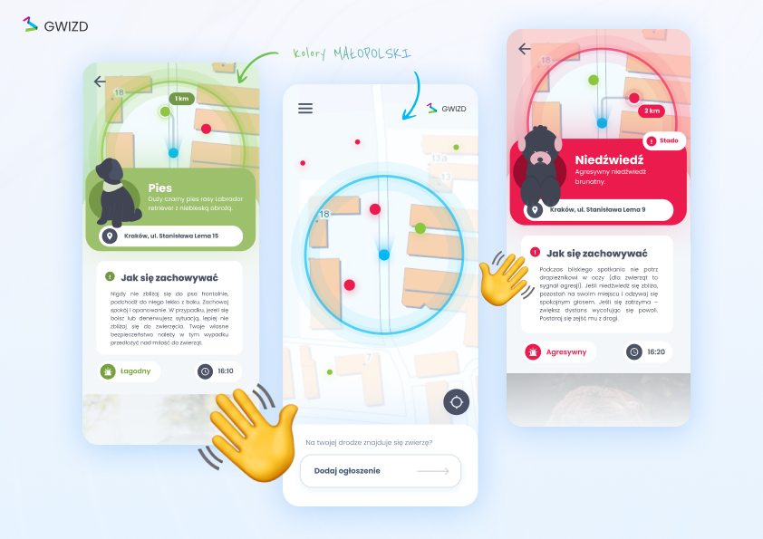
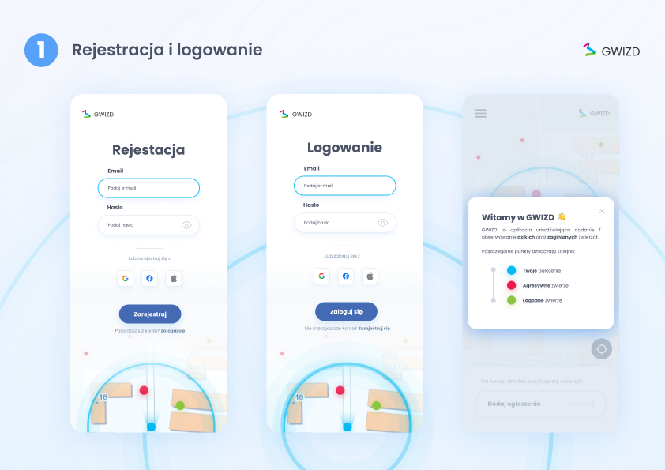
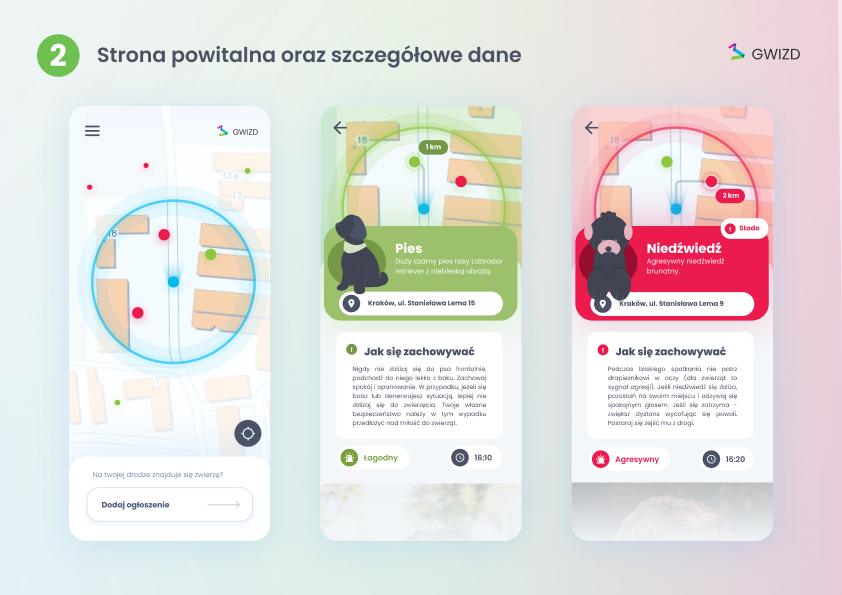
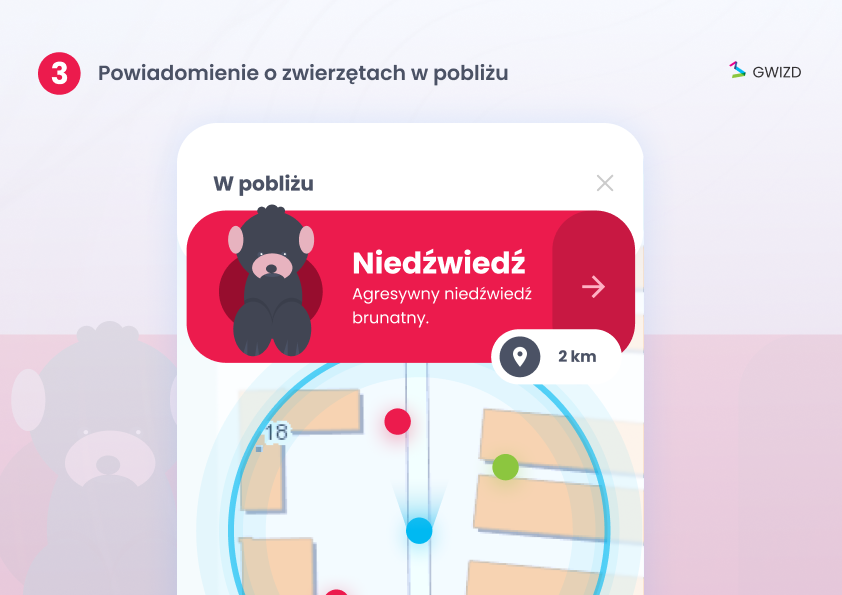
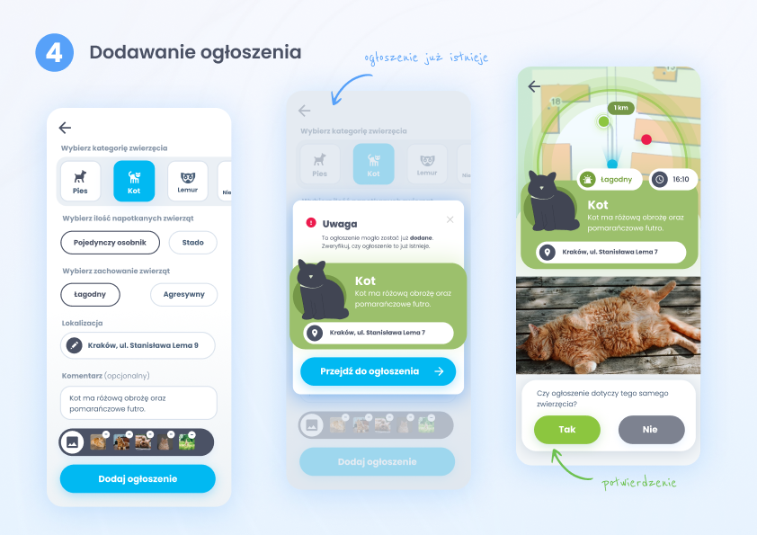
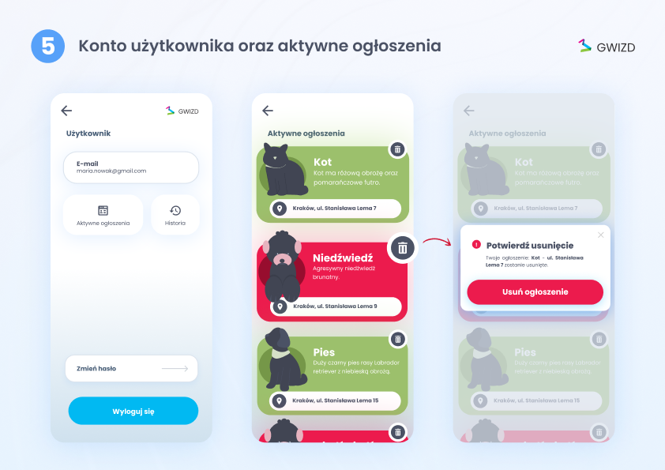
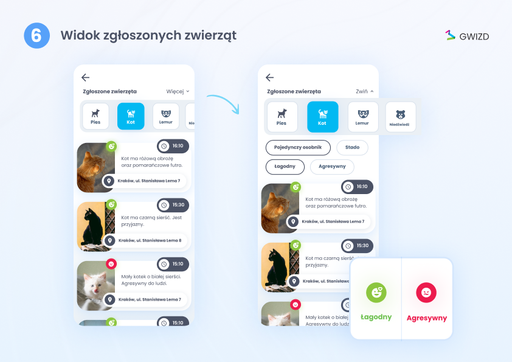

# Członkowie zespołu:
- Bartłomiej Smalec
- Kacper Pawlak
- Katarzyna Poręba 

 

# TechStack:
- Java 17
- Spring Boot
- Spring Security
- Spring Hibernate

- React
- Vite
- Prettier
- ESLint

 

 

# Pomysły:

# Aspekty techniczne:

  - dostępne na **wszystkich platformach**

  - używane sprawdzone nowoczesne technologie **OpenSource**

  - REST API - **jeden backend** dla wszystkich platform

 

# Design:

  - **intuicyjny** i **nowoczesny** design

  - **przyjazny** dla użytkownika

  - elementy **kolorystycznie** nawiązujące do **małopolski**

 

# Powiązanie z kategorią:

  - forma gry polegająca na wykonywaniu zadań i rywalizacji

  - tematyka ściśle związana ze zrównoważonym rozwojem

 

# WOW! Factor:
